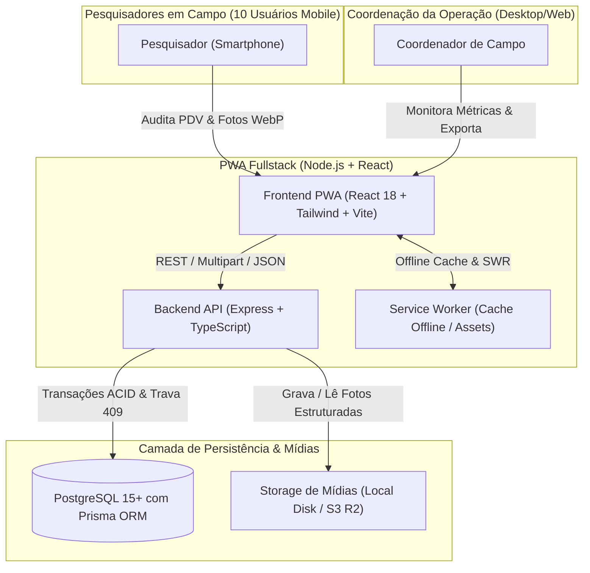
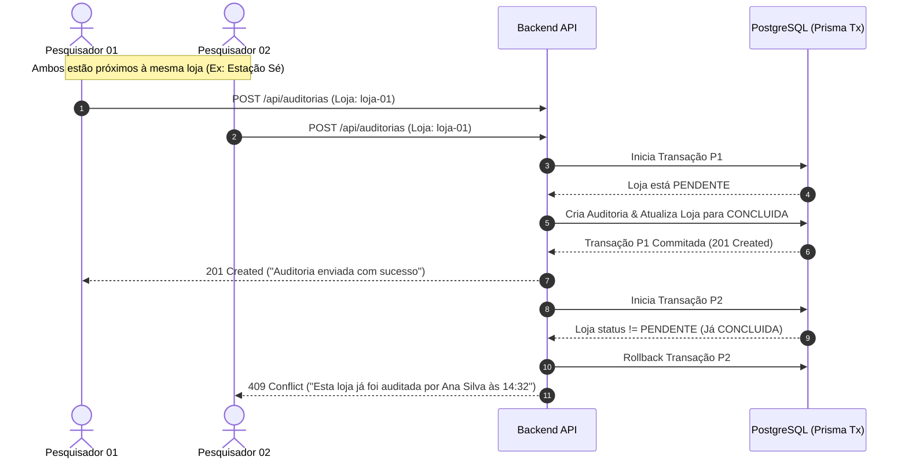

# Arquitetura do Sistema - PWA de Auditoria de PDV (Cliente Oculto)

Este documento detalha as decisões arquiteturais, topologia de componentes, fluxo de dados e controle de concorrência para a operação de campo com **10 pesquisadores simultâneos** e **57 lojas da RMSP**.

---

## 1. Visão Geral e Diagrama de Contexto (C4)



---

## 2. Diagrama de Sequência: Trava Anti-Duplicidade em Tempo Real

A trava anti-duplicidade atua em dois níveis complementares:
1. **No Cliente (Otimista & Reativo):** Ao selecionar ou digitar a loja, o autocomplete verifica o status. Se for `CONCLUIDA` ou `FINALIZADA_INOPERANTE`, o formulário é bloqueado imediatamente com alerta destacando quem auditou e a que horas.
2. **No Banco de Dados (Transacional & Pessimista):** Se dois pesquisadores submeterem simultaneamente a mesma loja, a transação no PostgreSQL (`lojaId` com checagem atômica) garante que apenas uma seja aceita (`201 Created`), rejeitando a concorrente com `409 Conflict`.



---

## 3. Estrutura e Padronização de Storage de Fotos

O armazenamento segue rigorosamente a convenção do projeto:

```text
uploads/
└── {cnpj_sem_pontuacao}/
    ├── foto_fachada_{timestamp}.webp
    ├── foto_geladeira_{timestamp}.webp
    ├── foto_marcas_{timestamp}.webp
    ├── foto_concorrentes_{timestamp}.webp
    ├── foto_caixa_{timestamp}.webp
    └── foto_display_{timestamp}.webp
```

- **Compressão Client-Side:** Executada no dispositivo do pesquisador antes do upload via `browser-image-compression`. Fotos nativas de 8MB-12MB são convertidas para WebP Full HD (1920x1080) com ~300KB-500KB.
- **Redução de Consumo de Dados:** Economia de mais de **95% de banda móvel**, essencial para conexões 3G/4G em subsolos de estações de metrô.

---

## 4. ADRs (Architecture Decision Records)

### ADR 01: Monorepo Modular vs Repositórios Separados
- **Decisão:** Monorepo único com pastas `src/client`, `src/server`, `src/shared`.
- **Motivo:** Compartilhamento direto dos tipos TypeScript e schemas Zod entre cliente e servidor, eliminando dessincronização de contratos de API.

### ADR 02: Express + Prisma ORM + PostgreSQL
- **Decisão:** Utilização de Express tipado com Prisma ORM sobre PostgreSQL.
- **Motivo:** Conexões transacionais robustas (`$transaction`), seeds idempotentes nativos e facilidade de integração com streams de arquivos para ZIP e CSV.

### ADR 03: Service Worker com vite-plugin-pwa
- **Decisão:** Service worker configurado com estratégia `NetworkFirst` para listagem de lojas e `StaleWhileRevalidate` para lista de pesquisadores e assets estáticos.
- **Motivo:** Permite que o pesquisador continue navegando e consultando lojas mesmo em áreas de sombra de sinal de celular no mezanino das estações de metrô.
