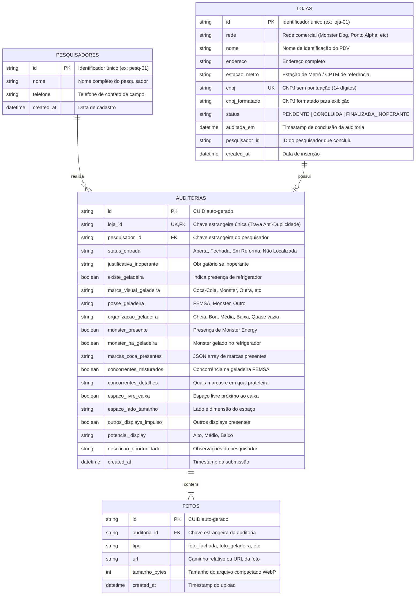

# Modelo Relacional do Banco de Dados - PDV Auditoria

Este documento descreve o modelo de dados relacional implementado em PostgreSQL e gerenciado via Prisma ORM.

---

## 1. Diagrama Entidade-Relacionamento (DER)

---

## 2. Tabelas e Índices

### Tabela `pesquisadores`
Armazena a equipe de 10 pesquisadores de campo.
- **PK:** `id` (VARCHAR)
- **Campos:** `nome` (VARCHAR), `telefone` (VARCHAR), `created_at` (TIMESTAMP)

### Tabela `lojas`
Armazena os 57 pontos de venda na Região Metropolitana de São Paulo.
- **PK:** `id` (VARCHAR)
- **Unique:** `cnpj` (VARCHAR 14 dígitos)
- **Índices de Performance:**
  - `idx_lojas_rede`: Otimiza filtros por rede no dashboard.
  - `idx_lojas_status`: Acelera filtragem de lojas pendentes versus concluídas.
  - `idx_lojas_cnpj`: Busca instantânea no autocomplete de campo.

### Tabela `auditorias`
Registra a auditoria finalizada de cada loja.
- **PK:** `id` (VARCHAR)
- **Unique & FK:** `loja_id` (VARCHAR) -> Referencia `lojas(id)`. A restrição de unicidade no banco atua como a garantia máxima de atomicidade contra concorrência e condições de corrida entre os pesquisadores.
- **FK:** `pesquisador_id` -> Referencia `pesquisadores(id)`.

### Tabela `fotos`
Guarda os registros fotográficos WebP vinculados a cada auditoria.
- **PK:** `id` (VARCHAR)
- **FK:** `auditoria_id` -> Referencia `auditorias(id)` com regra `ON DELETE CASCADE`.
- **Índice:** `idx_fotos_auditoria`: Acelera a compilação do relatório CSV e streaming do arquivo ZIP.

---

## 3. Seed Automático (`npm run db:seed`)

O script de seed (`prisma/seed.ts`) popula:
1. **10 Pesquisadores Pré-Cadastrados:** Nomes reais de pesquisadores e telefones formatados.
2. **57 Lojas da RMSP:** Distribuídas equilibradamente entre as redes:
   - **Monster Dog** (22 lojas)
   - **Ponto Alpha** (18 lojas)
   - **Better Pão de Queijo** (17 lojas)
   Todas localizadas em pontos de alto fluxo de passageiros nas linhas 1-Azul, 2-Verde, 3-Vermelha, 4-Amarela, 5-Lilás e CPTM (estações Sé, Luz, Brás, Paulista, Pinheiros, Tatuapé, Barra Funda, etc.).
